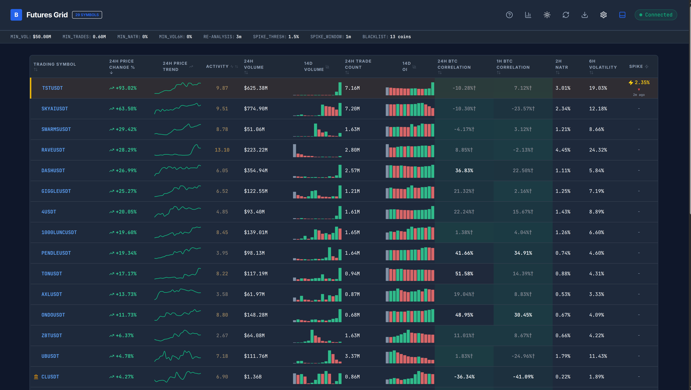

# Futures Grid v2.0.0



Real-time analysis dashboard for crypto futures markets. Identifies coins moving independently of Bitcoin (low correlation), showing high relative volatility, or experiencing sudden price spikes.


## 📋 Table of Contents

- [Overview](#overview)
- [Features](#features)
- [How It Works](#how-it-works)
- [Getting Started](#getting-started)
- [Usage Guide](#usage-guide)
- [Configuration](#configuration)
- [Metrics Explained](#metrics-explained)
- [Important Notices](#important-notices)
- [Technical Details](#technical-details)
- [License](#license)

## 🎯 Overview

Futures Grid is a browser-based dashboard that provides real-time analysis of crypto futures markets. It connects directly to exchange APIs from your browser to analyze and rank cryptocurrency pairs based on:

- **Price performance** (24h change percentage)
- **Correlation with Bitcoin** (24h and 1h timeframes)
- **Volatility metrics** (NATR and Parkinson's Realized Volatility)
- **Trading volume and activity**

The application runs entirely in your browser with no backend server required, making it fast, private, and easy to deploy.

## ✨ Features

### Core Features

- **Live WebSocket** – Real-time price and change updates via exchange streaming API
- **Spike Detection** – Alerts on sudden price moves within a configurable rolling window. Shows the worst spike, persists for a configurable duration, and uses a quiet period to avoid false clears.
- **Activity Score** – Composite metric of price velocity and tick density. Higher values signal momentum and attention.
- **BTC Correlation** – Pearson coefficient over 24h and 1h windows. Spot coins decoupling from Bitcoin.
- **Volatility** – NATR (2h) and Parkinson's Realized Volatility (6h) for multi-timeframe context.
- **Sparklines**
  - **Price Trend** – Last 24h price history (1h candles). Green = uptrend, red = downtrend.
  - **Volume (14d)** – 14-day trading volume bars. Rising bars = growing interest.
  - **Open Interest (14d)** – 14-day OI bars with flow analysis. Green = new positions, red = unwinding.
- **Symbol Blacklist** – Hide stables or majors from analysis.

### Data & Analytics

- **Real-time ranking** by price change percentage
- **Volume comparison** against Bitcoin's 24h volume
- **Trade count analysis** for liquidity assessment
- **Correlation heat mapping** with color-coded cells
- **Symbol blacklisting** to exclude unwanted pairs

## 🔧 How It Works

1. **Data Collection**: The app fetches exchange info and 24h ticker data from the exchange API
2. **Filtering**: Symbols are filtered based on your configured criteria (volume, trades, status)
3. **Analysis**: For each qualifying symbol, the app calculates:
   - Price correlation with BTC (24h and 1h)
   - Volatility metrics (NATR, Parkinson)
   - Volume ratios and trade statistics
4. **Ranking**: Results are sorted by price change percentage (default) or any column
5. **Live Updates**: WebSocket connection provides real-time price updates
6. **Periodic Refresh**: Full re-analysis occurs at your configured interval

## 🚀 Getting Started

### Prerequisites

- A modern web browser (Chrome, Firefox, Edge, Safari)
- Internet connection to access exchange APIs
- No installation required - runs entirely in the browser

### Installation

#### Option 1: Direct Browser Usage (Recommended)

Simply open `index.html` in your web browser:

```bash
# On Linux/Mac
open index.html

# On Windows
start index.html

# Or drag and drop the file into your browser
```

#### Option 2: Local Web Server

For best performance, serve the files using a local web server:

```bash
# Using Python 3
python -m http.server 8000

# Using Node.js (npx)
npx serve .

# Using PHP
php -S localhost:8000
```

Then navigate to `http://localhost:8000` in your browser.

#### Option 3: Deploy to Static Hosting

Deploy to any static hosting service:

- **GitHub Pages**: Push to a GitHub repository and enable Pages
- **Netlify**: Drag and drop the folder or connect Git repository
- **Vercel**: Connect Git repository or use CLI
- **Cloudflare Pages**: Connect Git repository

## 📖 Usage Guide

### Basic Workflow

1. **Open the Application**: Load `index.html` in your browser
2. **Accept Notice**: Read and accept the cookie/rate limit notice
3. **Wait for Analysis**: The app will automatically start analyzing market data
4. **View Results**: Browse the ranked list of futures pairs
5. **Customize**: Adjust settings to match your trading strategy

### Interface Components

#### Header Bar
- **Logo & Title**: Futures Grid v2.0.0
- **Symbol Count**: Number of qualifying symbols found
- **Help Button** (`?`): Opens this guide
- **Stats Toggle**: Show/hide statistics panel
- **Theme Toggle**: Switch between dark/light mode
- **Refresh Button**: Manually trigger re-analysis
- **Export CSV**: Download current results as CSV file
- **Settings Button**: Open configuration panel
- **Live Indicator**: Shows WebSocket connection status

#### Statistics Panel
When enabled, displays:
- Rate limit usage information
- Number of qualifying symbols
- Bitcoin reference volume (24h)
- Last execution timestamp

#### Main Data Table

| Column | Description |
|--------|-------------|
| **Trading Symbol** | Pair name (e.g., ETHUSDT). Click to copy. |
| **Price Change %** | 24h percentage change. Green = up, Red = down |
| **24h Quote Volume** | Total USDT volume in last 24h |
| **Volume vs BTC %** | Volume as percentage of BTC's volume |
| **24h Trade Count** | Number of trades in last 24h |
| **24h BTC Correlation %** | How closely price moves with BTC (24h) |
| **1h BTC Correlation %** | How closely price moves with BTC (1h) |
| **2h NATR Volatility %** | Normalized Average True Range (2h) |
| **6h Parkinson Volatility %** | Parkinson's Realized Vol (6h) |
| **1h Price Trend** | Mini sparkline chart showing recent price action |

#### Footer Bar
- Next full analysis countdown
- WebSocket connection status
- Version information

### Interactive Features

#### Sorting
Click any column header to sort by that metric:
- First click: Ascending order
- Second click: Descending order
- Icon indicates current sort direction

#### Row Actions
- **Click Row**: Copy symbol name to clipboard
- **Hover**: Reveals blacklist button (trash icon)
- **Blacklist**: Remove unwanted symbols from analysis

#### Settings Panel
Access via gear icon to configure:

1. **Min 24h Volume (USDT)**: Minimum trading volume threshold
2. **Min 24h Trades**: Minimum number of trades
3. **Min 2h NATR (%)**: Minimum volatility threshold
4. **Min 6h Parkinson (%)**: Minimum Parkinson vol threshold
5. **Full Re-Analysis Interval**: How often to recalculate metrics (minutes)
6. **Symbol Blacklist**: Manage excluded symbols

## ⚙️ Configuration

### Default Settings

| Setting | Default | Description |
|---|---|---|
| Minimum Volume | 50M | Filter by 24h quoted volume (USDT) |
| Minimum Trades | 600K | Filter by 24h trade count |
| Minimum NATR | 0 | Filter by Normalized Average True Range |
| Minimum Vol 6h | 0 | Filter by Parkinson volatility |
| Refresh Interval | 5 min | How often the analysis re-runs |
| Spike Threshold | 3% | Alert when price moves by this % within the spike window |
| Spike Window | 5 min | Rolling window for spike detection |
| Alert Persistence | 5 min | How long spike alerts remain visible after detection |

### Managing Blacklist

**Add Symbol:**
1. Open Settings (gear icon)
2. Type symbol name in blacklist input (e.g., "BTCUSDT")
3. Press Enter
4. Click "Apply & Refresh"

**Remove Symbol:**
1. Open Settings
2. Click × button next to symbol in blacklist
3. Click "Apply & Refresh"

**Or from table:**
- Hover over any row
- Click trash icon to blacklist that symbol

### Exporting Data

Click the download icon (CSV export) to save current results:
- File format: CSV (Comma Separated Values)
- Filename: `futures_analysis_YYYY-MM-DD.csv`
- Contains all visible columns and data
- Opens in Excel, Google Sheets, or any spreadsheet app

## ⚠️ Important Notices

### Cookie & Local Storage Usage

This application uses browser localStorage to save:
- Theme preference (dark/light)
- Configuration settings
- Cookie consent choice
- Symbol blacklist

**No personal data is collected or transmitted.** All data stays on your device.

### ⚠️ IP Rate Limit Warning

**CRITICAL**: This tool makes direct API calls to the exchange from your browser using your IP address.

**Risks:**
- Excessive requests may trigger exchange rate limits
- Your IP could be temporarily banned
- API errors may occur during high-frequency usage

**Rate Limits:**
- The exchange enforces request weight limits per IP
- This app uses ~1200 weight points per full analysis
- Standard limit: 2400 weight points per minute

**Mitigation Strategies:**
1. **Increase refresh interval**: Use 5-10 minutes between full analyses
2. **Reduce symbol count**: Use stricter filters (higher min volume/trades)
3. **Use VPN**: Rotate IP addresses if needed
4. **Run less frequently**: Manual refresh instead of auto-refresh
5. **Monitor errors**: Watch for API error messages

**By using this application, you acknowledge and accept these risks.**

### Disclaimer

This tool is for **informational and educational purposes only**.

- ❌ Not financial advice
- ❌ Not a trading recommendation system
- ❌ No guarantee of accuracy or completeness
- ✅ Use at your own risk
- ✅ Do your own research (DYOR)
- ✅ Consult professionals before trading

Cryptocurrency trading involves substantial risk of loss. Past performance does not indicate future results.

### Trademark Notice

This is an **unofficial, third-party tool** not affiliated with, endorsed by, or connected to Binance or any of its subsidiaries.

Binance is a trademark of Binance Holdings Ltd. All other trademarks belong to their respective owners.

## 🛠 Technical Details

### Architecture

- **Frontend**: React 18+ with Framer Motion animations
- **Styling**: Tailwind CSS
- **Charts**: Recharts library for sparklines
- **State Management**: React hooks (useState, useEffect, useRef)
- **Data Persistence**: Browser localStorage
- **Real-time Updates**: WebSocket connection to exchange

### API Endpoints Used

#### REST APIs
```
GET https://fapi.binance.com/fapi/v1/exchangeInfo
GET https://fapi.binance.com/fapi/v1/ticker/24hr
GET https://fapi.binance.com/fapi/v1/klines
```

#### WebSocket Stream
```
wss://fstream.binance.com/stream?streams={symbol}@ticker
```

### Data Flow

1. **Initial Load**: Fetch exchange info and 24h tickers
2. **Filtering**: Apply user-defined filters
3. **Kline Fetching**: Retrieve OHLCV data for calculations
4. **Metric Calculation**: Compute correlations and volatility
5. **WebSocket Connection**: Subscribe to live ticker updates
6. **UI Rendering**: Display sorted, filtered results
7. **Periodic Refresh**: Repeat analysis at configured interval

### Performance Considerations

- **Retry Logic**: Automatic retry with exponential backoff for failed API calls
- **Caching**: Kline data cached for 2 minutes to reduce API calls
- **Debouncing**: Rate-limited API requests to avoid bans
- **Efficient Updates**: WebSocket updates only price/change, not full recalculation
- **Memory Management**: Proper cleanup on unmount

### Browser Compatibility

- ✅ Chrome 90+
- ✅ Firefox 90+
- ✅ Edge 90+
- ✅ Safari 14+
- ❌ Internet Explorer (not supported)

**Required Features:**
- ES6+ JavaScript support
- WebSocket API
- Fetch API
- localStorage API
- CSS Grid/Flexbox

### File Structure

```
/workspace
├── index.html              # Main HTML entry point
├── README.md               # This documentation
├── LICENSE                 # MIT License
└── assets/
    ├── index-*.js          # Main application bundle (React code)
    ├── vendor-*.js         # Third-party dependencies
    └── index-*.css         # Compiled styles (Tailwind)
```

### Building from Source

This is a pre-built static application. To modify or rebuild:

1. **Original Stack**: React + Vite + Tailwind CSS
2. **Dependencies**:
   - framer-motion (animations)
   - recharts (sparkline charts)
   - lucide-react (icons)

To recreate:
```bash
# Create new Vite project
npm create vite@latest futures-grid -- --template react

# Install dependencies
npm install framer-motion recharts lucide-react tailwindcss

# Development
npm run dev

# Production build
npm run build
```

## 🐛 Troubleshooting

### Common Issues

**"Analysis failed" error:**
- Check internet connection
- Exchange API may be temporarily unavailable
- Wait a few minutes and retry
- Check browser console for details

**No symbols displayed:**
- Filters may be too strict
- Try lowering min volume/trades thresholds
- Clear blacklist
- Wait for market to be more active

**WebSocket not connecting:**
- Check firewall/antivirus settings
- Some networks block WebSocket connections
- Try different network or VPN

**App feels slow:**
- Reduce number of symbols (increase min volume)
- Increase refresh interval
- Close other browser tabs
- Clear browser cache

**Rate limit errors:**
- Increase refresh interval immediately
- Reduce symbol count with stricter filters
- Wait 15-60 minutes for ban to lift
- Consider using VPN

### Clearing Cache & Settings

To reset everything:

```javascript
// Open browser console (F12) and run:
localStorage.clear();
location.reload();
```

Or manually:
1. Open browser DevTools (F12)
2. Go to Application/Storage tab
3. Clear localStorage entries for the domain
4. Refresh page

## 📝 License

This project is licensed under the **MIT License** - see the [LICENSE](LICENSE) file for details.

```
Copyright (c) 2026 prelife

Permission is hereby granted, free of charge, to any person obtaining a copy
of this software and associated documentation files (the "Software"), to deal
in the Software without restriction, including without limitation the rights
to use, copy, modify, merge, publish, distribute, sublicense, and/or sell
copies of the Software, and to permit persons to whom the Software is
furnished to do so, subject to the following conditions:

The above copyright notice and this permission notice shall be included in all
copies or substantial portions of the Software.

THE SOFTWARE IS PROVIDED "AS IS", WITHOUT WARRANTY OF ANY KIND, EXPRESS OR
IMPLIED, INCLUDING BUT NOT LIMITED TO THE WARRANTIES OF MERCHANTABILITY,
FITNESS FOR A PARTICULAR PURPOSE AND NONINFRINGEMENT. IN NO EVENT SHALL THE
AUTHORS OR COPYRIGHT HOLDERS BE LIABLE FOR ANY CLAIM, DAMAGES OR OTHER
LIABILITY, WHETHER IN AN ACTION OF CONTRACT, TORT OR OTHERWISE, ARISING FROM,
OUT OF OR IN CONNECTION WITH THE SOFTWARE OR THE USE OR OTHER DEALINGS IN THE
SOFTWARE.
```

## 🤝 Contributing

This is a static deployment of Futures Grid v2.0.0. For contributions or issues:

1. Fork the repository
2. Create a feature branch
3. Make your changes
4. Test thoroughly
5. Submit a pull request

## 📞 Support

For questions or issues:

- Check this README first
- Review the in-app Help section
- Check browser console for error messages
- Ensure you're using a supported browser

---

**Built with ❤️ for crypto traders**

*Remember: Trade responsibly and never invest more than you can afford to lose.*
